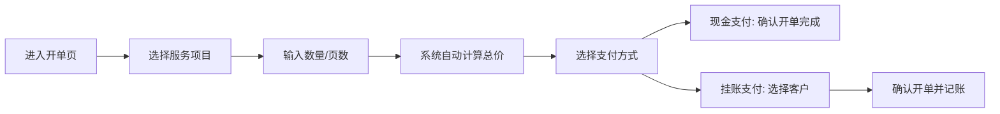
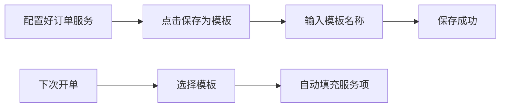

## 1. 产品概述

打印店订单管理工具是一款面向小型打印店的轻量级管理应用，帮助店主快速开单、管理挂账客户、统计营业数据。解决手动记账繁琐、月底对账困难、营业数据不清晰等痛点。

## 2. 核心功能

### 2.1 用户角色

| 角色 | 登录方式 | 核心权限 |
|------|----------|----------|
| 店主 | 无需登录 | 全部功能：开单、客户管理、统计报表、服务定价、模板管理 |

### 2.2 功能模块

1. **首页/开单页**：快速开单、选择服务项目、输入数量、自动计算总价、支付方式选择
2. **客户管理**：客户列表、新增客户、客户详情、挂账记录、还款记录
3. **统计报表**：每日营业统计、月度项目收入排行、挂账汇总
4. **服务管理**：服务项目列表、新增/编辑服务、设置单价
5. **模板管理**：常用模板保存、模板列表、快速调用

### 2.3 页面详情

| 页面名称 | 模块名称 | 功能描述 |
|----------|----------|----------|
| 开单页 | 服务选择 | 展示所有可售服务项目，点击添加到订单 |
| 开单页 | 订单明细 | 显示已选服务、数量、单价、小计，支持增减数量 |
| 开单页 | 结算区 | 显示总金额、选择支付方式（现金/挂账）、选择挂账客户、确认开单 |
| 客户管理 | 客户列表 | 展示所有客户、欠款金额、操作按钮 |
| 客户管理 | 新增客户 | 填写客户姓名、电话、备注 |
| 客户管理 | 客户详情 | 客户信息、挂账记录、还款记录、还款操作 |
| 统计报表 | 今日概览 | 今日现金收入、今日挂账金额、今日订单数 |
| 统计报表 | 月度项目排行 | 当月各服务项目收入排行、图表展示 |
| 统计报表 | 挂账汇总 | 所有客户欠款总额、欠款明细列表 |
| 服务管理 | 服务列表 | 所有服务项目、单价、分类、编辑删除 |
| 服务管理 | 新增/编辑服务 | 填写服务名称、单价、分类（复印/打印/扫描/装订） |
| 模板管理 | 模板列表 | 已保存的模板名称、对应服务配置 |
| 模板管理 | 保存模板 | 将当前订单配置保存为模板 |
| 模板管理 | 调用模板 | 一键将模板服务添加到订单 |

## 3. 核心流程

### 3.1 开单流程

### 3.2 挂账还款流程

### 3.3 模板使用流程

## 4. 用户界面设计

### 4.1 设计风格

- **主色调**：暖橙色（#f59e0b），传达温暖、活力的小店氛围
- **辅助色**：深青色（#0d9488），用于重要操作和数据强调
- **中性色**：暖灰色系，保持整体舒适感
- **按钮风格**：圆润边角、轻微阴影、悬停有缩放反馈
- **字体**：系统无衬线字体，清晰易读
- **布局风格**：卡片式布局、清晰分区、充足留白
- **图标风格**：线性图标，简洁现代

### 4.2 页面设计概览

| 页面名称 | 模块名称 | UI 元素 |
|----------|----------|---------|
| 开单页 | 顶部导航 | Logo、页面标题、菜单入口 |
| 开单页 | 服务选择区 | 网格布局服务卡片，显示名称、单价、分类标签 |
| 开单页 | 订单侧栏 | 固定右侧，订单明细列表、数量加减、删除按钮 |
| 开单页 | 结算区 | 大字号总价、支付方式切换、确认按钮 |
| 统计页 | 数据卡片 | 三个顶部卡片展示关键指标，渐变背景 |
| 统计页 | 图表区 | 柱状图展示月度项目收入排行 |
| 客户页 | 客户卡片 | 列表式卡片，显示客户名、电话、欠款金额、状态标签 |

### 4.3 响应式

- 桌面端优先设计（1024px+）
- 平板端自适应布局，服务网格调整列数
- 移动端订单侧栏改为底部抽屉式

### 4.4 动效设计

- 页面切换：淡入淡出过渡
- 卡片悬停：轻微上浮 + 阴影加深
- 按钮点击：缩放反馈
- 添加商品：飞入购物车动画
- 数字变化：平滑过渡效果
