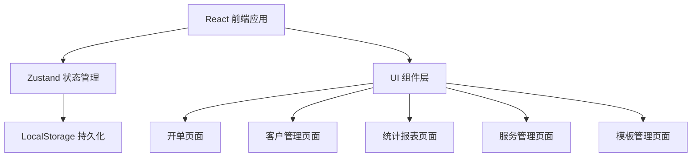
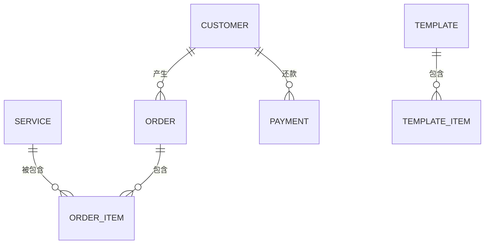

## 1. 架构设计



## 2. 技术选型说明

- **前端框架**：React 18 + TypeScript
- **构建工具**：Vite 5
- **样式方案**：Tailwind CSS 3
- **状态管理**：Zustand
- **图标库**：lucide-react
- **数据存储**：浏览器 LocalStorage
- **图表**：纯 CSS 实现柱状图（轻量，无需额外依赖）

## 3. 路由定义

| 路由路径 | 页面名称 | 说明 |
|----------|----------|------|
| / | 开单页 | 首页，快速开单 |
| /customers | 客户管理 | 客户列表、挂账管理 |
| /customers/:id | 客户详情 | 单个客户的挂账和还款记录 |
| /stats | 统计报表 | 每日和月度统计 |
| /services | 服务管理 | 服务项目定价管理 |
| /templates | 模板管理 | 常用模板管理 |

## 4. 数据模型

### 4.1 实体关系图



### 4.2 数据类型定义

```typescript
// 服务项目
interface Service {
  id: string;
  name: string;
  price: number;      // 单价（元）
  category: 'copy' | 'print' | 'scan' | 'binding'; // 分类
  unit: string;       // 单位（张、本等）
}

// 客户
interface Customer {
  id: string;
  name: string;
  phone: string;
  note: string;
  createdAt: string;
}

// 订单明细
interface OrderItem {
  serviceId: string;
  serviceName: string;
  price: number;      // 下单时的单价快照
  quantity: number;
  subtotal: number;   // 小计
}

// 订单
interface Order {
  id: string;
  items: OrderItem[];
  total: number;
  paymentType: 'cash' | 'credit';
  customerId?: string;  // 挂账客户ID
  customerName?: string;
  createdAt: string;
}

// 还款记录
interface Payment {
  id: string;
  customerId: string;
  amount: number;
  note: string;
  createdAt: string;
}

// 模板明细
interface TemplateItem {
  serviceId: string;
  quantity: number;
}

// 模板
interface Template {
  id: string;
  name: string;
  items: TemplateItem[];
  createdAt: string;
}
```

## 5. 状态管理设计

使用 Zustand 创建统一的 store，按功能切片：

```typescript
interface AppState {
  // 服务管理
  services: Service[];
  addService: (service: Omit<Service, 'id'>) => void;
  updateService: (id: string, data: Partial<Service>) => void;
  deleteService: (id: string) => void;

  // 客户管理
  customers: Customer[];
  addCustomer: (customer: Omit<Customer, 'id' | 'createdAt'>) => void;
  updateCustomer: (id: string, data: Partial<Customer>) => void;
  getCustomerDebt: (customerId: string) => number;

  // 订单管理
  orders: Order[];
  currentOrder: OrderItem[];
  addToOrder: (service: Service, quantity?: number) => void;
  updateOrderItemQuantity: (serviceId: string, quantity: number) => void;
  removeFromOrder: (serviceId: string) => void;
  clearOrder: () => void;
  checkout: (paymentType: 'cash' | 'credit', customerId?: string) => Order;

  // 还款管理
  payments: Payment[];
  addPayment: (customerId: string, amount: number, note?: string) => void;

  // 模板管理
  templates: Template[];
  saveTemplate: (name: string, items: OrderItem[]) => void;
  applyTemplate: (templateId: string) => void;
  deleteTemplate: (id: string) => void;

  // 统计
  getTodayStats: () => { cash: number; credit: number; orderCount: number };
  getMonthlyServiceStats: () => { serviceName: string; total: number }[];
  getTotalDebt: () => number;
}
```

## 6. 项目目录结构

```
src/
├── components/        # 公共组件
│   ├── Layout.tsx     # 布局组件
│   ├── Navbar.tsx     # 导航栏
│   ├── ServiceCard.tsx
│   ├── OrderItem.tsx
│   ├── CustomerCard.tsx
│   └── StatCard.tsx
├── pages/             # 页面组件
│   ├── OrderPage.tsx
│   ├── CustomersPage.tsx
│   ├── CustomerDetailPage.tsx
│   ├── StatsPage.tsx
│   ├── ServicesPage.tsx
│   └── TemplatesPage.tsx
├── store/             # 状态管理
│   └── useStore.ts
├── types/             # 类型定义
│   └── index.ts
├── utils/             # 工具函数
│   ├── storage.ts     # localStorage 封装
│   └── helpers.ts     # 通用帮助函数
├── data/              # 初始数据
│   └── seedData.ts    # 默认服务项目等
├── App.tsx
├── main.tsx
└── index.css
```

## 7. 初始数据

预置常见的打印店服务项目：

- **复印类**：黑白复印、彩色复印
- **打印类**：黑白打印、彩色打印、照片打印
- **扫描类**：黑白扫描、彩色扫描
- **装订类**：胶装、骑马钉、铁环装
